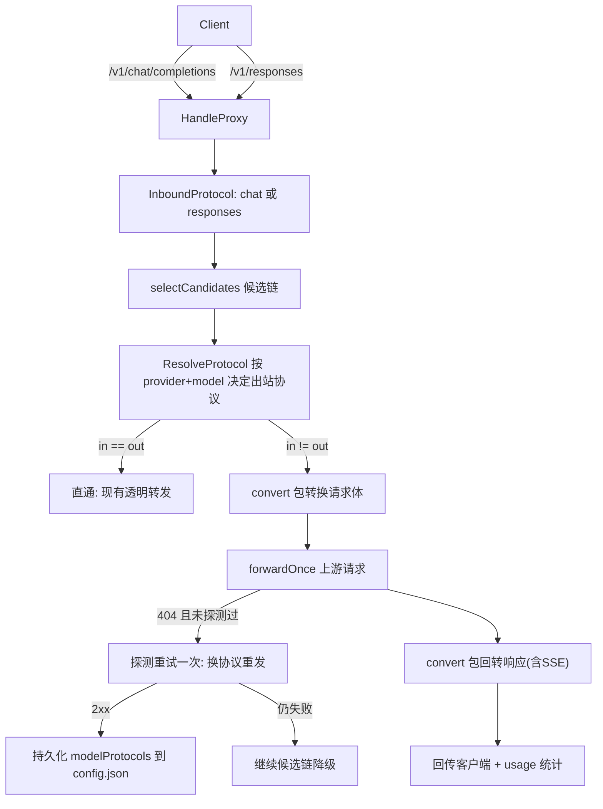

# Responses API 协议支持与自动转换

Feature Name: responses-protocol-conversion
Updated: 2026-08-27

## Description

为 LLM Proxy 增加 OpenAI Responses API（`/v1/responses`）入站端点与 Provider 协议类型配置，实现 chat ↔ responses 双向协议转换（非流式 + SSE 流式），并以 (provider, model) 粒度做协议自动探测与持久化。范围：文本、usage、工具调用（function calling）转换；状态化端点（GET /v1/responses/{id} 等）明确不支持并返回结构化错误。

## Architecture



- 入站协议由请求路径决定：`/v1/responses` → responses；其余 POST 补全类（`/v1/chat/completions`）→ chat。
- 出站协议按优先级：`provider.ModelProtocols[model]` > `provider.Protocol`（默认 `chat`）。
- 同协议走现有 `forwardOnce`/`streamResponse` 路径，行为零变化；异协议在进入转发前改写请求体与目标 URL，收到响应后经转换器回写。

## Components and Interfaces

### 1. `internal/domain/domain.go` — 数据模型扩展

```go
type Provider struct {
    // ...现有字段...
    Protocol       string            `json:"protocol,omitempty"`        // "chat"(默认) | "responses"
    ModelProtocols map[string]string `json:"modelProtocols,omitempty"`  // model -> 实测协议
}
```

- `ProviderFromDomain`（internal/proxy/app.go:75）同步透传 `Protocol`、`ModelProtocols`。
- config 校验（internal/config/config.go validate）：`protocol` ∈ {"", "chat", "responses"}，`modelProtocols` 值同集合；非法时启动报错。

### 2. 新包 `internal/convert` — 协议转换器（纯函数，独立可测）

```go
// 请求体转换（map 入参，返回新 map；不改原对象）
func ChatRequestToResponses(chat map[string]any, stream bool) map[string]any
func ResponsesRequestToChat(resp map[string]any) map[string]any

// 非流式响应转换（[]byte 入，[]byte 出）
func ChatResponseToResponses(body []byte) []byte
func ResponsesResponseToChat(body []byte) []byte

// 流式增量转换器：逐块 Push 原始上游文本，输出待写给客户端的文本
type ChatStreamToResponses struct{ /* state */ }
func (t *ChatStreamToResponses) Push(chunk string) string   // 返回可写片段(可为空)
func (t *ChatStreamToResponses) Finish() string             // 收尾事件(response.completed / [DONE])

type ResponsesStreamToChat struct{ /* state */ }
func (t *ResponsesStreamToChat) Push(chunk string) string
func (t *ResponsesStreamToChat) Finish() string
```

映射规则（首期范围：文本 + usage + function calling）：

**请求 responses→chat**
- `instructions` → 前置一条 system message 后移除字段
- `input`: string 直接作为 user message；数组项按 `role`+`content`(text parts 拼接) 转 messages；`function_call` 输出项转 assistant 的 `tool_calls`，`function_call_output` 转 role=tool message
- `tools`(type=function) ↔ chat `tools`(type=function)：name/description/parameters 平移
- `tool_choice`, `parallel_tool_calls`, `temperature`, `top_p`, `stream` 同名平移；`max_output_tokens`→`max_tokens`
- 其余 responses 专有字段丢弃（background、metadata、previous_response_id 等触发日志警告）

**请求 chat→responses**
- `messages`: system/dev → instructions 或 system 角色项；user/assistant 文本 → input 数组；assistant.tool_calls → function_call 项；role=tool → function_call_output 项
- `max_tokens`→`max_output_tokens`；tools/tool_choice 平移映射
- `response_format(json_object)` 映射 `text.format`

**响应 chat→responses（非流式）**
- `{id, model, created, choices[0].message.content}` → `{id, object:"response", status:"completed", created, model, output:[{type:"message", role:"assistant", content:[{type:"output_text", text}]}], usage:{input_tokens, output_tokens, total_tokens}}`
- tool_calls → `output:[{type:"function_call", name, arguments, call_id}]`，status=incomplete+len 时 finish_reason=length

**响应 responses→chat（非流式）**
- 聚合所有 `message` 项的 output_text 为 choices[0].message.content；`function_call` 项聚合进 tool_calls
- usage 反向映射 prompt_tokens/completion_tokens；finish_reason 由 status 推导（completed→stop; incomplete & reason=max_output_tokens→length）

**流式 chat→responses（服务端转译）**
- 入流首个含 id/model chunk 发出 `response.created` 与 `response.output_item.added`
- 每个 `delta.content` 文本块 → 一条 `response.output_text.delta`
- finish_reason chunk + 有 usage 的最终 chunk → `response.output_item.done` + `response.completed`(带 usage)；结尾补 `[DONE]`

**流式 responses→chat**
- 忽略 created/in_progress 等状态事件，仅消费 `response.output_text.delta` → 标准 chat chunk（首个 chunk 附 delta.role="assistant"）
- `response.function_call_arguments.delta` → tool_calls 增量 chunk（index/id/name 拼装）
- `response.completed` → finish_reason chunk；对 `status: incomplete` 映射 length

**usage 解析扩展**：UsageParser 增加 responses 变体解析（`usage.input_tokens/output_tokens`），按 Content-Type/路径选择解析器，保证两种协议的请求日志统计一致。

### 3. `internal/proxy/app.go` — HandleProxy 分支

新增流程（在候选循环内）：

```go
inProto := inboundProtocol(h.origPath)           // "chat"|"responses"|"unknown"
outProto := resolveOutbound(p, h.reqModel)        // ModelProtocols[model] ?? Protocol ?? "chat"

if protoCompatible(inProto, outProto) {
    // 现有路径不动：ResolveTargetURL + forwardOnce + streamResponse
} else {
    targetURL = convertTargetURL(p.BaseURL, p.OpenAIEndpoint, inProto, outProto)
    candBody = convert.RequestBody(inProto, outProto, candBody)
}
```

- `convertTargetURL`：outbound=chat 复用现 `ResolveTargetURL`；outbound=responses 在 base 上拼 `/responses`（base 已含 /v1 类后缀）或 `/v1/responses`，逻辑与现函数后缀表一致。
- 异协议成功转发时用 `convert.StreamTransformer` 包装 `streamResponse` 的写客户端路径：读到的每段文本先 `Push()` 得到转译文本再写出；EOF 后 `Finish()`。usage 取自转换器内嵌的协议感知 parser。
- 未知路径（如 `/v1/embeddings`）保持现状直通。

### 4. 探测重试（Probe once）— app.go 内 helper

触发条件（同时满足）：异协议或直通路径上、POST 对话类端点、上游返回 **HTTP 404**、该 `(p.ID, reqModel)` 本轮尚未探测过。
动作：以 alternate 协议重建 targetURL/请求体重新 `forwardOnce` 一次；成功则：
1. `a.Cfg.Update(func(c){ c.Providers[i].ModelProtocols[model] = alt })` 持久化；
2. 内存中同步更新当前候选 `p.ModelProtocols`；
3. 系统日志记录 requestID/provider/model/proto from→to。
失败则保持 `modelProtocols` 不变，走既有降级链记录。

> 探测仅针对 404（多数网关对不存在 path 返回 404）；405/501 视为路由存在但方法问题，不重试，避免放大错误流量。

### 5. `internal/handlers/handlers.go` — CRUD 支持

- `applyPatch` 增加 `protocol` 字段处理；create/update 成功路径统一调用新 helper `resetProbes(c, id)` 清空 `ModelProtocols`（Req 1a-4），并把结果落库。
- create/update 中校验 protocol 合法性，非法值返回 400。

### 6. Web UI（React）

- `src/types.ts`：Provider 增加 `protocol?: "chat" | "responses"`、`modelProtocols?: Record<string,string>`。
- `src/components/ProviderCard.tsx`：
  - 编辑弹窗 Base URL 上方加 **Protocol Type** 下拉（OpenAI Chat Completions / OpenAI Responses），新建默认 chat；preset `openai` 保持 chat；
  - 卡片头部显示协议徽标（如 `CHAT` / `RESPONSES`）；
  - handleSave 提交 `protocol` 字段。
- Playground（Playground.tsx）无需改动：direct-chat 继续 POST `/api/providers/{id}/chat/completions`，服务端 Provider 为 responses 型时由 HandleDirectChat 内部走 chat→responses 转换（实现复用 App.HandleProxy 同一 helper）。

### 7. `internal/proxy/models.go` — HandleDirectChat 适配

检测目标 provider 协议：若 `resolveOutbound(p, body.model)` 为 responses，则将 chat 请求体转换后转发至 `/responses` 端点并回转响应；否则维持现状。

## Data Models

config.json 示例（变更部分）：

```jsonc
{
  "providers": [
    {
      "id": "openai-official",
      "protocol": "responses",          // 默认协议，缺省 "chat"
      "modelProtocols": {               // 自动探测写入，保存 provider 时清空
        "gpt-4o-mini": "chat",
        "codex-max": "responses"
      }
    }
  ]
}
```

## Correctness Properties

1. 存量无 `protocol` 配置加载后全部请求行为等价于升级前（chat 直通）。
2. 同协议请求逐字节透传，转换器零介入。
3. 任一转换分支下，客户端收到的响应体为其入站协议的可反序列化 JSON/SSE。
4. usage 三元组（prompt/completion/cached）在任意协议链路下均有统计写入 request_logs。
5. `ModelProtocols` 仅由探测成功路径写入、由 provider create/update 清空；并发 Update 由 Manager 锁串行化。
6. 每个 (provider, model, 单次客户端请求) 至多一次探测重试，禁止无限循环。

## Error Handling

| 场景 | 行为 |
|------|------|
| 入站 `/v1/responses/{id}` 等不支持的状态化操作 | 返回 405 JSON `{error:"stateless proxy: only POST /v1/responses is supported"}` |
| 上游 404 → 探测重试仍 404 | 记录降级原因，继续下一候选；全失败返回 502 汇总 |
| 请求体字段无法映射（如 multimodal part） | 保底策略：跳过该项并记 warn 日志；请求体完全不可映射返回 400 |
| 转换响应 JSON 解析失败 | 原样透传原始字节，warn 日志，中断 usage 统计 |
| 流式转换中途客户端断开 | 现有 499 路径不变 |

## Test Strategy

- **单测 `internal/convert`**：
  - 请求双向映射表驱动用例（system/user/assistant/tool_calls/function_call_output/tools/max_tokens）
  - 非流式响应双向转换含 usage/finish_reason 断言
  - 流式：模拟 SSE chunk 序列喂 `Push`，断言逐段输出与最终 `Finish` 事件完整性（`response.created/delta/completed/[DONE]`）
- **单测 `internal/config`**：protocol/modelProtocols 加载、默认值、非法值校验、cloneConfig 深拷贝
- **单测 `internal/proxy`**（沿用 httptest 上游模式，参考 degrade_test.go）：
  - responses 入站 × chat 上游：断言收到的响应为合法 response object、request_logs usage 正确
  - chat 入站 × responses 上游（404 先命中再探测成功场景）：断言 modelProtocols 持久化 + 第二次请求直达正确端点
  - 直通回归：存量配置请求 diff 等价
- **前端**：`npm run lint` + 手动验证 Provider 表单协议下拉与徽标渲染

## References

[^1]: internal/proxy/app.go - HandleProxy 主转发循环与降级链
[^2]: internal/proxy/client.go - ResolveTargetURL URL 组装规则
[^3]: internal/handlers/handlers.go#L528 - applyPatch 局部更新实现
[^4]: src/components/ProviderCard.tsx - Provider 编辑表单
