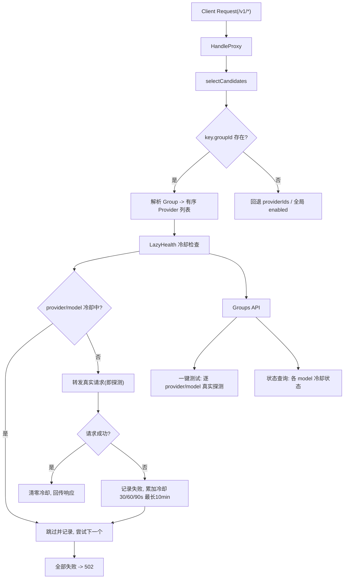
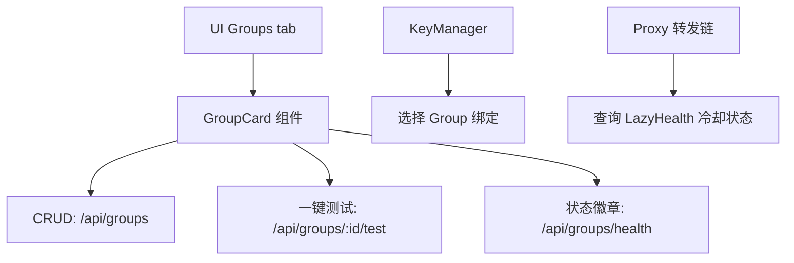

# Group Routing with Lazy Probing Health States

Feature Name: group-routing
Updated: 2026-08-21

## Description

引入 Group（Provider 组）管理实体，将 key 绑定多个 provider 的降级链能力上移至 Group 层。Key 绑定 Group（groupId 字段），Group 内 provider 按顺序执行降级；全部失败返回 502。采用"冷却判断 + 真实请求即探测"的懒探测机制隔离故障 provider/model，冷却按 30s/60s/90s 累加，最长 10 分钟。管理界面新增 Groups tab，支持 Group CRUD 与一键测试（成功/失败/耗时）。

## Architecture





## Components and Interfaces

### 1. domain 层（internal/domain/domain.go）

新增 `ProviderGroup` 实体：

```go
type ProviderGroup struct {
    ID        string   `json:"id"`
    Name      string   `json:"name"`
    ProviderIDs []string `json:"providerIds"`
    CreatedAt string   `json:"createdAt"`
}
```

`Config` 新增字段 `Groups []ProviderGroup`。`VirtualKey` 新增 `GroupID string`（groupId）。

`rawConfig` / `rawGroup` / `mergeConfig` / `normalize` / `validate` 同步扩展（groups 支持 `id/name/providerIds/createdAt`）。

### 2. lazyhealth 包（新，internal/lazyhealth/lazyhealth.go）

实现 provider/model 粒度的冷却状态存储：

```go
type Entry struct {
    FailCount    int
    CooldownUntil int64 // UnixMilli
}

type Tracker struct {
    mu sync.Mutex
    m map[string]*Entry // key: "providerID|model"
}

func New() *Tracker
func (t *Tracker) InCooldown(providerID, model string) bool // 过期自动清除并返回 false
func (t *Tracker) RecordFailure(providerID, model string)   // 30s/60s/90s... 最长 10min
func (t *Tracker) RecordSuccess(providerID, model string)
func (t *Tracker) Snapshot() map[string]HealthState         // 供 UI/API 查询
```

冷却时长计算（等差序列，与需求"30s/60s/90s"一致）：

```go
const (
    BaseMS = 30000  // 30s
    MaxMS  = 600000 // 10min
)
coolMS := BaseMS * failCount // 30s, 60s, 90s, ... 等差累加
if coolMS > MaxMS { coolMS = MaxMS }
```

### 3. proxy 层（internal/proxy/app.go）

- `selectCandidates` 扩展：解析 key 的 groupId → 展开为有序 provider 列表（保持 Group 内 ProviderIDs 顺序）。
- 转发循环集成 LazyHealth：
  - 每轮对 `(p.ID, candModel)` 调用 `InCooldown`；冷却中则跳过并记录。
  - 转发成功 → `RecordSuccess`；失败 → `RecordFailure`。
- `App` 持有 `*lazyhealth.Tracker`，通过 `NewApp` 注入。
- Group 路由仅在该候选链来自 Group 时应用冷却判断（作用域限定）。

### 4. handlers 层（internal/handlers/handlers.go）

新增 Group CRUD handlers：
- `HandleListGroups` GET /api/groups
- `HandleCreateGroup` POST /api/groups
- `HandleUpdateGroup` PUT /api/groups/:id
- `HandleDeleteGroup` DELETE /api/groups/:id
- `HandleGroupHealth` GET /api/groups/health（返回各 group 内 provider/model 冷却状态）
- `HandleGroupTest` POST /api/groups/:id/test（一键测试，逐 provider/model 真实探测，返回成功/失败/耗时）

Key 相关 handlers 扩展 `groupId` 字段支持。

### 5. server 层（internal/server/server.go）

注册 `/api/groups` 与 `/api/groups/` 路由。

### 6. 前端（src/）

- `types.ts`：新增 `ProviderGroup` 类型，`VirtualKey` 增加 `groupId`。
- `App.tsx`：新增 `"groups"` tab，加载/操作 groups 状态。
- `Header.tsx`：新增 "Groups" tab 项。
- `GroupCard.tsx`（新组件）：Group CRUD 表单、provider 排序、状态徽章、一键测试按钮。
- `KeyManager.tsx`：创建/编辑 key 时支持选择 Group（groupId），并兼容 providerIds。

## Data Models

```json
{
  "groups": [
    {
      "id": "g_abc123",
      "name": "Primary Chain",
      "providerIds": ["openai", "deepseek", "gemini"],
      "createdAt": "2026-08-21T10:00:00.000Z"
    }
  ],
  "keys": [
    {
      "key": "sk-proxy-...",
      "name": "Client Key",
      "groupId": "g_abc123",
      "providerIds": ["openai"]
    }
  ]
}
```

冷却状态内存模型（不持久化）：

```
key: "openai|gpt-4o"
value: { FailCount: 3, CooldownUntil: 1724000000000 }
```

## Correctness Properties

1. Group 内 provider 顺序即转发降级顺序，且与配置中 ProviderIDs 数组顺序一致。
2. 冷却时长严格单调不减：30s → 60s → 90s → ... → 封顶 10min。
3. 冷却期内该 provider/model 不被转发尝试，不产生探测流量。
4. 冷却期过后下一次请求自动放行（恢复探测），成功即清零。
5. 同 provider 不同 model 的冷却状态互不影响。
6. 冷却判断仅对来自 Group 的候选链生效，providerIds fallback 链不受影响。
7. key 同时存在 groupId 与 providerIds 时，groupId 优先。
8. 全部 provider/model 冷却中或失败时返回 502，错误信息含最后失败 provider。
9. 并发请求下冷却状态更新线程安全（互斥锁）。

## Error Handling

| 场景 | 处理 |
|------|------|
| Group 引用了不存在的 provider | 跳过该 provider，标记"缺失"，继续下一个 |
| key.groupId 引用了不存在的 Group | 回退到 providerIds / 全局 enabled |
| 冷却期 provider 全部跳过 | 记录跳过日志，返回 502（或 429 若全部冷却） |
| 一键测试时 provider 不可达 | 返回失败 + 连接错误原因 |
| 一键测试全部失败 | 返回逐项失败结果与原因，HTTP 200（结果数组内标注） |
| 转发失败 | RecordFailure 累加冷却；继续下一个候选 |
| Group 删除时被 key 引用 | key 回退 providerIds；前端提示 |

## Test Strategy

### 单元测试

- `lazyhealth`：冷却时长序列（30/60/90/封顶 10min）、过期自动清除、RecordSuccess 清零、并发安全。
- `config`：groups 读写、raw 兼容、validate 重复 id。
- `proxy.selectCandidates`：key.groupId 展开、groupId 优先于 providerIds、group 不存在回退。
- `proxy.HandleProxy`：
  - key 绑定 Group → 按组内顺序降级，全部失败 502。
  - 冷却期内跳过该 model，记录跳过。
  - 冷却期后恢复尝试，成功清零。
  - 每 provider 失败记录正常请求日志。
- `handlers`：Group CRUD、health、一键测试。

### 端到端验证

- 配置 group（provider 顺序 A→B），A 返回 500 → 自动切 B 成功。
- 连续失败 A 后，第二次请求直接跳过 A。
- 一键测试返回逐项成功/失败/耗时。

## References

[^1]: (internal/proxy/app.go#L87) - selectCandidates 现有候选链解析
[^2]: (internal/proxy/app.go#L132) - HandleProxy 转发循环
[^3]: (internal/domain/domain.go#L17) - VirtualKey 实体
[^4]: (internal/circuit/circuit.go#L50) - 现有指数退避冷却参考
[^5]: (src/components/KeyManager.tsx) - key 绑定 provider 的现有 UI
